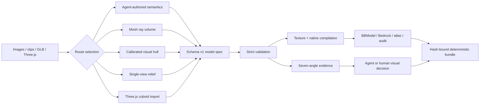

# img2blockbench technical design

## Purpose

img2blockbench is an agent-assisted compiler for native Minecraft-style
Blockbench assets. It accepts images, calibrated views or clip frames,
textured meshes, and constrained Three.js scenes. It produces semantic
cuboids, bones, pivots, a bounded pixel atlas, Bedrock geometry, audit data,
review evidence, and a deterministic ZIP.

The central design choice is to separate perception from compilation. An
agent decides what the subject is, which parts matter, and what unseen
geometry can be inferred. Deterministic code validates those decisions,
reconstructs measured geometry where possible, and produces reproducible
artifacts. A passing structural audit is never treated as proof of visual
resemblance.

See [the cycle history](AUTORESEARCH_CYCLES.md) for how this architecture
evolved and [the metric contract](METRICS_AND_REGRESSIONS.md) for definitions
and interpretation rules.

## Goals and non-goals

The platform is designed to:

- preserve recognizable silhouette, topology, proportions, and identity;
- construct real three-dimensional cuboid volume rather than a front-facing
  billboard;
- keep the output editable, riggable, and native to Blockbench and Minecraft;
- use source-derived color only when camera, visibility, and provenance are
  explicit;
- distinguish observed evidence from proxy views and agentic inference;
- fail visibly when a component, input, or review artifact cannot be retained;
- make builds deterministic and portable.

It is not designed to recover unknowable hidden anatomy from one image, turn
arbitrary pixels directly into a photoreal mesh, infer camera calibration from
a clip, or automatically certify resemblance.

## System boundary

The agent owns route selection, semantic interpretation, hidden-surface
inference, and final visual judgment. The engine owns validation, coordinate
math, visibility, texture packing, deterministic rendering, compilation,
hashing, and packaging.

## Reconstruction routes

| Route | Input contract | Geometry method | What it may claim |
| --- | --- | --- | --- |
| Semantic | One or more reviewed references | Agent-authored bones and cuboids, optionally using semantic geometry helpers | Authored topology and disclosed hidden-side inference |
| Mesh | Textured GLB/GLTF and optional image | Six-direction ray sampling, voxel cleanup, adaptive cuboid fit | Source-relative all-axis surface or volume evidence at the selected resolution |
| Multiview | Explicit orthographic-yaw cameras, images, and masks | Visual-hull carving and adaptive cuboid fit | Volume constrained by the supplied calibrated silhouettes |
| Relief | One image plus optional mask and depth map | Scanline, adaptive, or PCA-oriented depth-field cuboids | Source-facing silhouette and bounded 2.5D depth |
| Three.js | Constrained `Object3D.toJSON` scene | Supported boxes, transforms, pivots, and materials mapped to the common spec | Imported scene geometry, not arbitrary JavaScript behavior |

Every route converges on the same schema-version-1 intermediate
representation described in
[the model specification](../skill/img2blockbench/references/model-spec.md).
This keeps compilation, review, audit, and downstream export independent from
the way geometry was obtained.

## Common intermediate representation

The model specification records:

- exact reference hash and dimensions;
- subject type, description, symmetry, and uncertainty;
- a quality contract with identity features, target cuboid budget, required
  views, and review targets;
- geometry precision independently from texture density;
- bounded materials and optional face-level source patches;
- a single-root semantic bone tree;
- cuboids with names, roles, centers, sizes, rotations, origins, and materials;
- landmarks for flat identity details;
- collision dimensions;
- route-specific generation and evidence metadata;
- an optional player-wearable contract.

The specification is the editable source of truth. Generated `.bbmodel`, PNG,
`geo.json`, audit, manifest, and ZIP files are derived outputs and should not
be hand-patched.

## Mesh reconstruction

The mesh route loads every supported scene geometry with its node transform,
applies one explicit canonical transform, and normalizes the result into model
space. It then:

1. casts orthographic rays on X, Y, and Z, retaining evidence for both signed
   directions on each axis;
2. records triangle intersections, visible depths, opposed surfaces, and odd
   parity rather than silently assuming every mesh is closed;
3. builds surface or solid occupancy according to the disclosed fill mode;
4. removes only components below configured absolute and fractional limits,
   using true six-neighbor connectivity;
5. samples UV, vertex, face, or material colors at ray hits and reduces them to
   a bounded palette;
6. seeds at least one adaptive leaf per retained component and greedily splits
   leaves while the cuboid budget permits;
7. fails when the budget cannot represent all retained components instead of
   dropping a horn, wheel, weapon, or accessory;
8. rasterizes the actual fitted cuboid union back into the voxel grid;
9. evaluates overlap, per-axis depth envelopes, silhouette precision, and
   one-to-one component connectivity;
10. emits source-versus-fit panels for front, back, left, right, top, bottom,
    and isometric review.

The anti-pancake gate is relative to the source mesh. A genuinely thin sword
is allowed to remain thin; a deep vehicle may not collapse into the same
profile. The current generic bounds require complete source axis-span and
depth-envelope coverage, zero collapsed source rays, at least `0.25` model
voxel precision, at least `0.50` per-axis silhouette precision, at least
`0.35` per-axis depth-envelope precision, no more than `3.0×` depth-envelope
inflation, six signed views, and one-to-one fitted components.

The automatic mesh output has one static, nonsemantic root. It preserves
shape and component structure, but a separate semantic anatomy and rigging
pass is still required before character animation.

## Calibrated multiview and clips

The multiview route accepts explicit orthographic yaw, image and mask paths,
center pixels, pixels-per-unit, volume bounds, and evidence labels. It does
not estimate camera motion. Clip ingestion only extracts caller-selected
timestamps through `ffmpeg` and preserves the supplied calibration.

For each candidate voxel, the engine projects into every calibrated mask and
retains only points inside the visual hull. It then cleans six-connected
components, fits bounded cuboids, and fuses color only from visible source
surfaces. Input order is normalized, so equivalent manifests generate the
same result.

Independent depth requires at least two non-parallel observed yaw axes.
Near-duplicate images do not increase observed constraint rank. A
`synthetic_proxy` may constrain a reconstruction, but it cannot turn inferred
depth into observed evidence. As with mesh fitting, retained components are
either represented or the command fails on budget.

## Single-image relief

The relief route separates foreground extraction from geometry generation.
It accepts automatic segmentation, an exact-resolution external mask, or a
subject bounding box used as a mask/segmentation region of interest. An
optional grayscale depth map can create layered one-sided or symmetric
thickness.

Three decompositions address different shapes:

- `scanline` preserves a simple stepped silhouette;
- `adaptive` merges a depth field into larger native cuboids;
- `oriented` rectifies a long thin mask to its principal axis, decomposes it,
  and rotates all cuboids back around one shared pivot.

Geometry precision is separate from atlas texel density so a narrow diagonal
can retain nonzero thickness without forcing a huge texture. This route is
explicitly source-facing. A high reprojection score cannot establish correct
rear anatomy.

## Semantic geometry

The semantic route is the most general path for creatures, characters, and
mechanical assemblies whose identity depends on named anatomy. Its helpers
produce deterministic:

- arbitrary 3D chains with shared joint pivots;
- local-Z flat blade chains;
- radial profiles and bilateral assemblies;
- ellipsoid and superellipsoid occupancy merged exactly into cuboids;
- negative-space subtraction before merging;
- tapered, parented branch graphs with explicit root attachments.

Graph construction is atomic. Duplicate IDs, cycles, multiple parents,
detached nodes, degenerate segments, invalid roots, and non-finite dimensions
fail without partially mutating the model. Compiled oriented-cuboid contact
audits validate attachment geometry rather than trusting parent names alone.

## Texture design

The default visual target is clean Minecraft abstraction, not photographic
projection and not procedural grime. Materials use a small semantic palette,
nearest-neighbor texels, and solid fallback for unseen surfaces. Random dither
is forbidden as a generic realism technique.

Calibrated reference baking projects only through declared cameras. A z-buffer
selects the frontmost cuboid face, foreground masks reject background pixels,
and incidence plus stable view IDs resolve ties. The `minecraft` style
prefilters microdetail, uses approximately one texel per model unit, shares a
bounded global palette, and limits each semantic material to a small ramp.
Literal `source` projection remains opt-in and is labeled separately.

The evidence report distinguishes observed texels from solid fallback texels.
This prevents unobserved rear surfaces from being described as source-derived.

## Wearable export

A piloted exoskeleton is modeled first as the complete reference subject. A
wearable contract then names a removable occupant subtree, retained shell
root, player fit transform, collision, and physical interfaces such as waist,
hand-control, back, and boot anchors.

The compiler derives a second shell-only model, removes occupant claims from
its quality contract, applies the player-space transform, validates metadata,
bone ownership, collision values, anchor mapping, and interface coordinates,
and emits a Bedrock attachable descriptor. Asset-specific tests and visual
review—not the generic exporter—establish that the cavity is open and the
interfaces physically contact the shell. This keeps “a vehicle containing a
pilot” distinct from “equipment a player can wear.” Animation and runtime
attachment remain downstream responsibilities.

## Rendering and evidence

Two evidence modes are deliberately separate:

- mesh review compares source ray-albedo, fitted cuboids, and overlap;
- semantic review renders only the generated model and explicitly sets
  `source_imagery_included: false` and `resemblance_claimed: false`.

Both require front, back, left, right, top, bottom, and isometric views. The
generic review also creates an all-angle sheet, silhouette hashes, bounding
boxes, foreground occupancy, and a duplicate-view warning. Pixel-identical
views are suspicious but can be legitimate symmetry, so uniqueness is a
warning rather than a blocking gate.

Review manifests are bound to canonical model content. Exact source-file
hashes protect the original authoring review, while a content fingerprint
excludes delivery-local reference and mesh locator/status fields plus generated
review records. It retains geometry, materials, texture rules, source hashes,
semantics, and quality contracts. This makes a delivered specification
rebuildable without allowing substantive model changes to reuse stale evidence.

## Compilation and packaging

Strict validation runs before compilation. The compiler then packs the atlas,
emits native Blockbench and Bedrock structures, audits bones/elements/UVs, and
creates a manifest whose artifact sizes and SHA-256 values are deterministic.
ZIP member order, metadata, permissions, and timestamps are fixed.

The default reference policy bundles the source. The `external` policy keeps
its dimensions and SHA-256 but places the locator under
`external-reference/FILENAME`, records the original `source_file_name`, and
omits the standalone source from the ZIP. It does not claim to remove source
pixels intentionally baked into a texture.

Before writing, the build computes every core, wearable, and review output and
rejects paths that would overwrite the authored spec, source reference, or
review manifest. It also rejects unsafe symlinked, escaping, or mutually
colliding outputs.

## Release boundary

The compact release uses an explicit allowlist. It includes runtime modules,
the agent skill, normative references, design documentation, packaging
metadata, license, and notices. It excludes benchmark media, generated models,
private inputs, demo assets, tests, and development tools.

The release builder refuses a dirty source tree unless explicitly asked for a
development bundle. It records the exact commit, checks version consistency,
rejects workstation paths, fixes ZIP timestamps and permissions, and writes an
external manifest and checksum file. NumPy and trimesh remain optional extras;
the base compiler imports without them, and specialized commands provide an
actionable extra name when a dependency is missing.

## Principal design decisions

| Decision | Reason | Regression avoided |
| --- | --- | --- |
| Use complementary routes | No single representation is strongest for every input | Treating one image as complete 3D truth |
| Keep a shared semantic spec | All routes can use one compiler and audit contract | Route-specific output drift |
| Prefer semantic cuboids over voxel soup | Minecraft readability and editability matter more than raw density | Noisy, unriggable models |
| Use six-neighbor components | Diagonal contact is not a physical attachment | Merged or dropped limbs and accessories |
| Fail on component-budget pressure | Silent truncation creates plausible but incomplete assets | Missing disconnected mesh or visual-hull parts |
| Measure depth relative to source | Thin props and deep vehicles need different expectations | Rejecting swords or accepting pancake vehicles |
| Separate observed, proxy, and inferred evidence | Provenance must match what the input proves | Duplicate images falsely claiming depth |
| Use fixed-camera evidence where possible | Post-render fitting can hide scale and translation errors | Inflated silhouette scores |
| Make Minecraft texture style the default | Source identity should survive without photo collage or noise | Generic noisy base style |
| Separate pilot preview from wearable shell | The same reference supports two different runtime semantics | Baking a pilot into player equipment |
| Require visual review after structural gates | Metrics cannot judge identity, expression, or appeal | “Audit passed” being mistaken for likeness |
| Bind reviews to canonical content | Packaging paths may change; authored content may not | Stale evidence or unrebuildable deliveries |
| Namespace external references | Source names can equal generated atlas names | Reference/texture aliasing and corruption |

## Known limitations

- A visual hull cannot recover hidden concavity or articulation.
- A mesh fit is only as complete as its input mesh, transform, resolution, and
  retained components.
- A semantic model can be detailed but still wrong if the agent inferred the
  topology incorrectly.
- Perspective cameras estimated from pictures are evidence fixtures, not
  calibrated photogrammetry.
- Static cuboid and wearable exports do not create production animations.
- Hashes prove artifact identity and reproducibility, not visual quality.

The operational workflow and approval rules remain normative in
[the skill](../skill/img2blockbench/SKILL.md) and
[the quality rubric](../skill/img2blockbench/references/quality-rubric.md).
